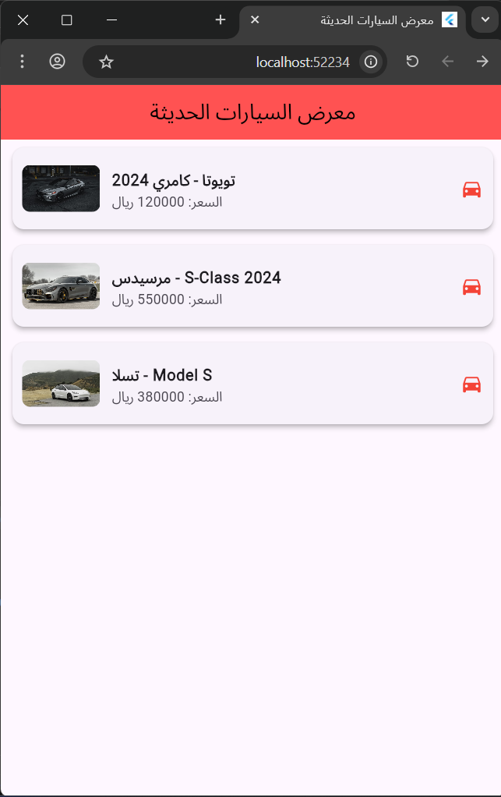
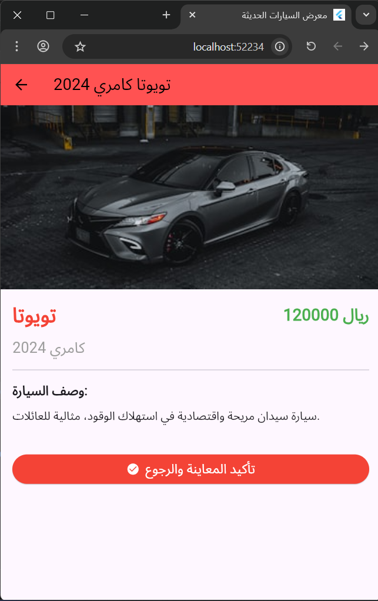

المحاضرة الخامسة 
التمرين الثاني 

تطبيق Flutter تعليمي لاستعراض السيارات الحديثة وتجربة التنقل المتقدم بين الشاشات.

مميزات التطبيق:

- عرض السيارات باستخدام صور من الإنترنت وبيانات منظمة.
- 
-  شاشة مخصصة لكل سيارة تعرض السعر والوصف بدقة.
- 
-  نظام إشعارات (SnackBar) يظهر عند العودة من شاشة التفاصيل لتأكيد المعاينة.

## الشاشات:

